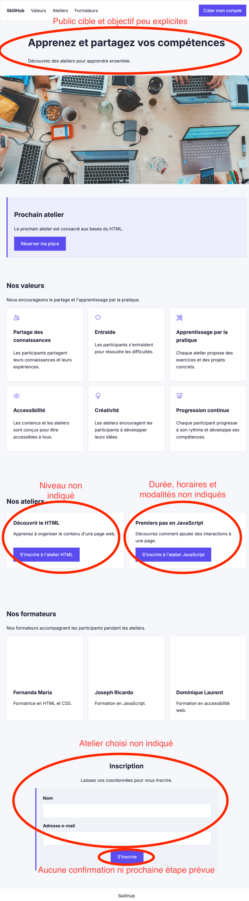

# TP1 — Personas et User Journey

## Persona 1 — Apprenant

### Contexte
Vit en France et cherche une formation professionnelle. Il utilise principalement son téléphone et peut avoir des difficultés avec certains termes en français.

### Objectif
Trouver rapidement une formation adaptée à son niveau et à ses disponibilités, puis s'inscrire facilement.

### Aisance
À l'aise avec les outils numériques courants, mais ne maîtrise pas toujours le vocabulaire technique en français.

### Freins
Un vocabulaire trop technique, un niveau de formation difficile à identifier et un processus d'inscription trop compliqué.

### Contraintes d'accès
Le français n'est pas sa langue maternelle. Il peut avoir des difficultés à comprendre des termes complexes ou très techniques.

### Sur quoi il repose
Hypothèse assumée.

### Décisions d'interface

1. Utiliser un vocabulaire simple et clair, en évitant les termes techniques inutiles.
2. Afficher clairement le niveau de chaque formation dès la présentation de la formation.

### Idée abandonnée

Utiliser un vocabulaire très technique dans les descriptions des formations.

## Persona 2 — Formateur

### Contexte
Formateur indépendant qui utilise principalement son ordinateur pour créer et gérer ses formations en ligne.

### Objectif
Créer et publier rapidement une formation, puis gérer facilement les inscriptions des apprenants.

### Aisance
À l'aise avec les outils numériques et les plateformes en ligne, mais ne souhaite pas apprendre à utiliser une interface complexe.

### Freins
Un formulaire de publication trop long, la perte des informations déjà saisies et une gestion des inscriptions difficile à trouver.

### Contraintes d'accès
Utilise régulièrement le clavier pour naviguer et souhaite pouvoir utiliser les principales fonctions sans dépendre uniquement de la souris.

### Sur quoi il repose
Hypothèse assumée.

### Décisions d'interface

1. Sauvegarder automatiquement les informations saisies pendant la création d'une formation.
2. Permettre d'utiliser les principales fonctions de la plateforme avec le clavier.

### Idée abandonnée

Utiliser un formulaire unique, long et complexe pour créer une formation.

-------------------------------------------------------------------------------------------------------------------------------

# User Journey — Apprenant

| Étape | Point de contact | Action | Attente | Douleur | Décision |
|---|---|---|---|---|---|
| Découverte | Page d'accueil | Découvre SkillHub et consulte la page d'accueil. | Comprendre rapidement ce que propose SkillHub. | Il ne comprend pas immédiatement à qui s'adresse la plateforme. | Afficher dès le début une présentation claire de SkillHub et de son public. |
|---|---|---|---|---|---|
| Exploration | Section « Nos ateliers » | Parcourt les ateliers disponibles. | Trouver rapidement un atelier adapté à son niveau. | Le niveau des ateliers n'est pas clairement visible. | Afficher clairement le niveau de chaque atelier dans la liste. |
|---|---|---|---|---|---|
| Décision | Carte de l'atelier | Consulte les informations de l'atelier avant de s'inscrire. | Vérifier rapidement si l'atelier lui convient. | Les informations essentielles comme le niveau, la durée et les horaires ne sont pas indiquées. | Ajouter sur chaque atelier les informations essentielles : niveau, durée, horaires et modalités. |
|---|---|---|---|---|---|
| Inscription | Formulaire d'inscription | Remplit le formulaire après avoir choisi un atelier. | Savoir clairement à quel atelier il s'inscrit et terminer rapidement. | Le formulaire ne précise pas l'atelier choisi. | Afficher clairement l'atelier sélectionné dans le formulaire d'inscription. |
|---|---|---|---|---|---|
| Confirmation | Après l'envoi du formulaire | Attend la confirmation de son inscription. | Recevoir une confirmation claire et connaître les prochaines étapes. | Aucune confirmation claire ni prochaine étape n'est prévue. | Afficher un message de confirmation avec les prochaines étapes à suivre. |

## Ce que le parcours condamne dans la page actuelle

1. La page d'accueil ne précise pas suffisamment à qui s'adresse SkillHub et ce que l'utilisateur peut y faire.
2. Le niveau des ateliers n'est pas indiqué, ce qui empêche l'apprenant de savoir rapidement si la formation lui convient.
3. Les informations essentielles comme la durée, les horaires et les modalités des ateliers ne sont pas indiquées.
4. Le formulaire d'inscription ne précise pas l'atelier choisi par l'utilisateur.
5. La page actuelle ne prévoit pas de confirmation claire après l'inscription ni d'informations sur les prochaines étapes.

### Capture annotée de la landing page

